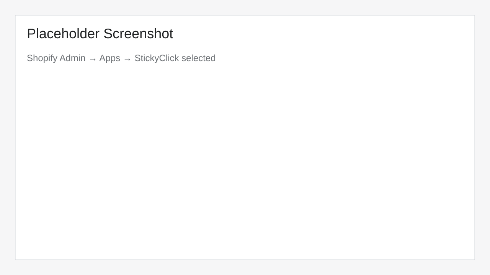
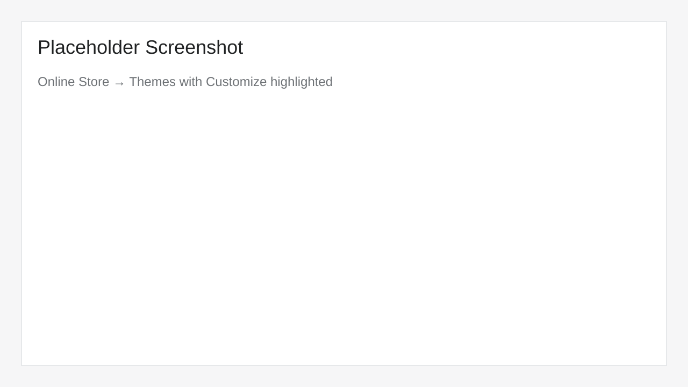
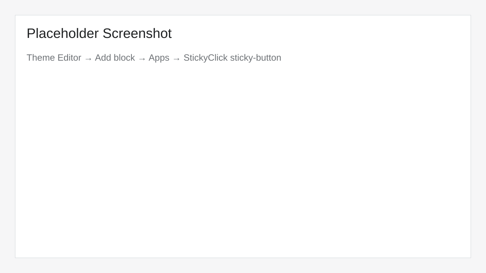
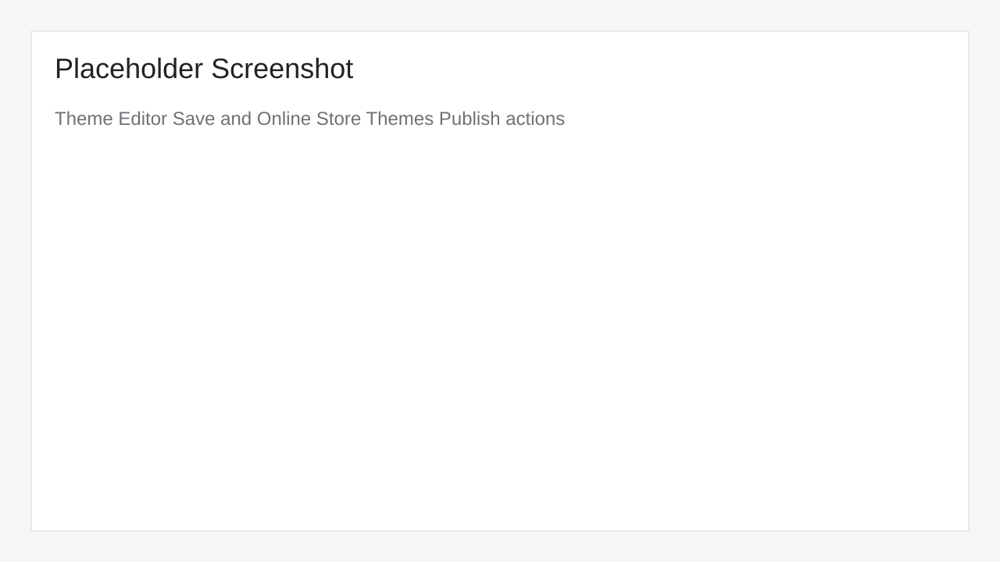
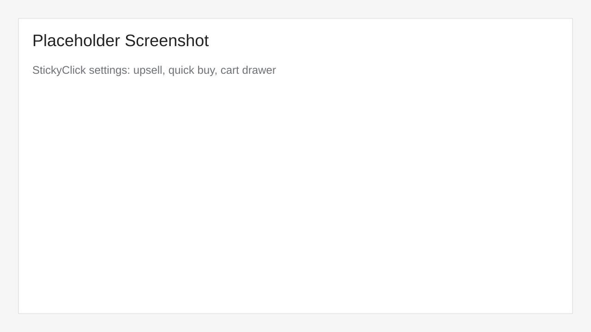

# StickyClick Theme Extension Onboarding

Use this guide during app review and merchant setup to install and verify the `sticky-button` theme app extension.

## Who this is for

- **App reviewers**: quickly validate installation and storefront behavior.
- **Merchants**: enable the block on your live theme and configure core conversion settings.

## Setup steps

### 1) Install the app

1. In Shopify Admin, open **Apps**.
2. Select **StickyClick**.
3. Complete the app install/authorization flow.

> Expected result: the app opens in admin and settings load without errors.

### 2) Open the Theme Editor

1. In Shopify Admin, go to **Online Store → Themes**.
2. On your current theme, click **Customize**.

> Recommended: confirm you are editing the intended theme (live vs draft) before continuing.

### 3) Add and enable the `sticky-button` app block

1. In Theme Editor, navigate to a product template (for example **Products → Default product**).
2. Click **Add block** in the relevant product section.
3. Open the **Apps** tab.
4. Select **StickyClick – sticky-button** (app block).
5. Ensure the block visibility toggle is enabled.

> If your theme supports app embeds for this feature, also verify app embed is enabled in **App embeds**.

### 4) Save and publish the theme

1. Click **Save** in the Theme Editor.
2. If changes were made in a draft theme, go back to **Online Store → Themes**.
3. Click **Publish** on that draft theme when ready.

> Changes made only in draft themes are not visible on the live storefront until published.

### 5) Configure key settings in StickyClick

In the StickyClick app admin, review and configure:

- **Upsell**: enable/disable upsell prompt and choose upsell product.
- **Quick Buy**: enable direct purchase flow from sticky button.
- **Cart Drawer**: open cart drawer after add-to-cart when supported by theme.
- **Button text/styles/position**: verify sticky CTA aligns with brand and UX.
- **Quantity behavior**: default quantity and increment/decrement controls.

After changing settings, click **Save**, then refresh storefront product pages to validate behavior.

## Troubleshooting

### Block not visible in Theme Editor

- Confirm you are on a **product template** where app blocks are supported.
- Confirm you are editing the correct section before clicking **Add block**.
- In **Add block → Apps**, search for `sticky` or `StickyClick`.
- Re-open Theme Editor after app install to refresh extension availability.

### App embed disabled

- In Theme Editor, open **App embeds** (left sidebar).
- Find StickyClick-related embed entry and toggle it **on**.
- Click **Save**.

### Changes not showing on storefront

- Confirm you saved changes in Theme Editor.
- Confirm the edited theme is **published** (not only a draft).
- Hard refresh storefront product page or test in a private browser session.

## Reviewer checklist

- [ ] App installs successfully.
- [ ] `sticky-button` app block can be added in Theme Editor.
- [ ] Block remains enabled after save/reload.
- [ ] Theme changes are visible on published storefront.
- [ ] Upsell, Quick Buy, and Cart Drawer settings update storefront behavior.

## Related links

- Support page: `/support`
- App listing review notes: `docs/app-listing-review-notes.md`
